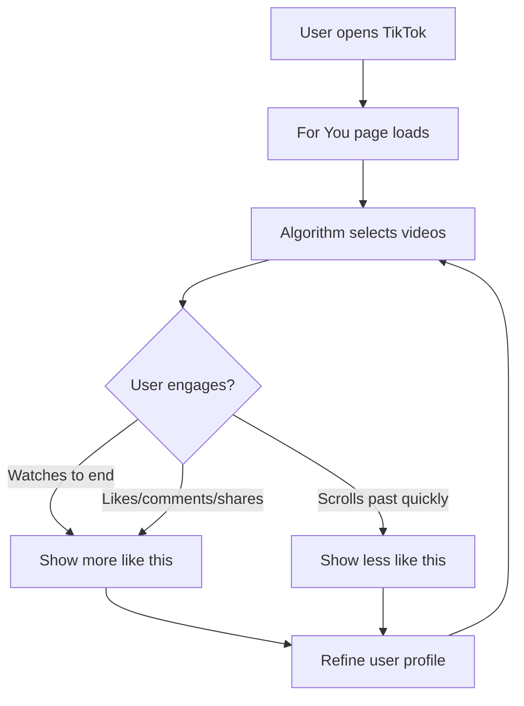
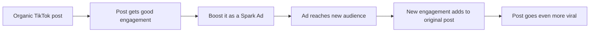

## The platform where ads do not look like ads

TikTok changed advertising forever. For the first time, the best-performing ads are the ones that look like regular content — not polished commercials, not stock footage with text overlays, but real people talking about real things in a format native to the platform.

With over 1 billion monthly active users spending an average of 95 minutes per day on the app, TikTok is one of the most powerful advertising platforms ever created. And it is still underpriced compared to Meta and Google.

## How TikTok actually works (the For You page)

Before understanding TikTok ads, you need to understand TikTok itself.

### The For You page algorithm

When you open TikTok, you see the **For You page (FYP)** — an infinite, personalized feed of videos. Unlike Instagram (where you see content from people you follow) or YouTube (where you search for content), TikTok's algorithm decides what to show you based on your behavior.

The algorithm weighs these signals (roughly in order of importance):

1. **Watch time** — did the user watch the full video? Rewatch it?
2. **Engagement** — likes, comments, shares, saves
3. **Content signals** — captions, sounds, hashtags, visual content
4. **Account signals** — device type, language, country
5. **Following** — content from people you follow (but this is a small factor)

### Why this matters for ads

TikTok ads appear **in the For You feed**, mixed in with organic content. The algorithm treats ads similarly to organic content — if users engage with your ad (watch it, like it, comment), the algorithm will show it to more similar users.

This creates a unique dynamic: **a great TikTok ad can outperform its budget because the algorithm amplifies it.** A bad TikTok ad — one that looks like a traditional commercial — gets skipped instantly, and the algorithm quickly stops showing it.

<Note>
  **"Make TikToks, not ads"** is not just a marketing slogan from TikTok. It is genuinely the best strategic advice for the platform. The ads that perform best are indistinguishable from organic content until the user sees the "Sponsored" label.
</Note>

## TikTok ad types explained

TikTok offers several ad formats. Here is every type, what it looks like, and when to use it.

### In-Feed Ads (start here)

In-Feed ads appear in the For You page as users scroll. They look like regular TikTok videos with a "Sponsored" label and a call-to-action button at the bottom.

| Aspect | Details |
|--------|---------|
| **Where it appears** | For You page, between organic videos |
| **Format** | Vertical video (9:16), 5-60 seconds |
| **Sound** | On by default (unlike other platforms) |
| **CTA** | Button at bottom (Download, Shop Now, Learn More, etc.) |
| **Best for** | App installs, website traffic, conversions |
| **Minimum budget** | $20/day per ad group |
| **Who should use it** | Everyone — this is the standard ad format |

<Tip>
  **In-Feed Ads are the only format you need to know as a beginner.** All other formats are either more expensive, more complex, or designed for large brands. Master In-Feed Ads first.
</Tip>

### Spark Ads (your secret weapon)

Spark Ads are a unique TikTok feature that lets you **boost existing organic TikTok posts as ads.** Instead of creating a separate ad, you promote a TikTok video that already exists — yours or a creator's.

| Aspect | Details |
|--------|---------|
| **Where it appears** | For You page, same as In-Feed |
| **What is different** | Links to a real TikTok account profile, keeps all organic engagement |
| **Why it works** | Feels more authentic; users can visit your profile, see comments, follow you |
| **Engagement** | Likes, comments, shares on the ad also appear on the organic post |
| **Best for** | Boosting content that is already performing well organically |
| **Who should use it** | Anyone with a TikTok account |

**How Spark Ads work:**

<Tip>
  **Post organic content first, then boost winners as Spark Ads.** This lets you test creative for free, see what resonates, and only spend money amplifying content that already works. It is the most cost-effective approach to TikTok advertising.
</Tip>

### TopView Ads

TopView is a premium placement — your ad is the **first thing users see** when they open TikTok. It plays full-screen for up to 60 seconds.

| Aspect | Details |
|--------|---------|
| **Where it appears** | First video when opening TikTok |
| **Format** | Full-screen video, up to 60 seconds |
| **Cost** | Premium pricing (typically $50,000+ per day, varies by market) |
| **Best for** | Major brand launches, movie releases, product announcements |
| **Who should use it** | Large brands with big budgets |

<Warning>
  **TopView is not for most developers.** It requires a large budget and is purchased through TikTok's sales team, not self-serve. Mentioning it here for completeness — you will not use this.
</Warning>

### Brand Takeover

Similar to TopView, Brand Takeover shows a full-screen ad when users open TikTok, but as a static image or 3-5 second video.

| Aspect | Details |
|--------|---------|
| **Cost** | $50,000+ per day |
| **Best for** | Mass awareness, big brand campaigns |
| **Who should use it** | Enterprise brands only |

### Branded Hashtag Challenge

You create a hashtag challenge and TikTok promotes it. Users create their own videos using your hashtag, generating massive user-generated content.

| Aspect | Details |
|--------|---------|
| **Cost** | $150,000+ for 6 days |
| **Best for** | Viral brand awareness, user-generated content |
| **Example** | #InMyDenim by Guess generated 38M+ views |
| **Who should use it** | Brands with large budgets looking for viral moments |

### Branded Effects

Custom AR filters, stickers, and effects that users can apply to their own videos. Think of Snapchat-style face filters but branded with your app or product.

| Aspect | Details |
|--------|---------|
| **Cost** | $80,000+ |
| **Best for** | Interactive brand experiences |
| **Who should use it** | Consumer brands with creative budgets |

### Summary: Which ad type to use

| Your situation | Recommended format |
|---------------|-------------------|
| **Just starting out** | In-Feed Ads |
| **Have a TikTok account with organic content** | Spark Ads |
| **Want the most control** | In-Feed Ads |
| **Budget under $5,000/month** | In-Feed Ads + Spark Ads |
| **Budget $5,000-50,000/month** | In-Feed Ads + Spark Ads + Creator content |
| **Budget $50,000+/month** | All formats including TopView |

## TikTok's audience — who is on the platform

| Demographic | Percentage of TikTok users |
|------------|---------------------------|
| **Age 18-24** | 30% |
| **Age 25-34** | 31% |
| **Age 35-44** | 20% |
| **Age 45-54** | 11% |
| **Age 55+** | 8% |
| **Female** | 54% |
| **Male** | 46% |

### Key audience insights

- **TikTok is no longer just Gen Z.** The 25-44 age group now makes up over 50% of the platform
- **Users are highly engaged:** average session length is 10+ minutes, with multiple sessions per day
- **TikTok users are shoppers:** 67% say TikTok inspires them to shop, even when they were not planning to
- **Music and sound matter:** 88% of users say sound is essential to the TikTok experience (versus Meta where most people watch without sound)

## Cost benchmarks

TikTok's ad costs are still generally lower than Meta, though the gap is narrowing as more advertisers join.

### Overall averages

| Metric | What it means | Average range |
|--------|--------------|--------------|
| **CPM (Cost Per 1,000 Impressions)** | What you pay per 1,000 people who see your ad | $3 - $10 |
| **CPC (Cost Per Click)** | What you pay each time someone clicks your ad | $0.30 - $1.00 |
| **CPI (Cost Per Install)** | What you pay each time someone installs your app | $1.00 - $5.00 |
| **CTR (Click-Through Rate)** | Percentage of viewers who click | 0.5 - 2% |
| **CVR (Conversion Rate)** | Percentage of clickers who install/convert | 5 - 15% |

### Cost by region

| Region | Avg CPM | Avg CPI | Notes |
|--------|---------|---------|-------|
| **United States** | $6 - $12 | $2 - $6 | Most expensive, largest market |
| **United Kingdom** | $5 - $10 | $1.50 - $5 | Premium English-speaking market |
| **Western Europe** | $4 - $8 | $1.50 - $4 | Germany, France, Spain, Italy |
| **Southeast Asia** | $1 - $3 | $0.30 - $1.50 | Very cheap, high volume |
| **Latin America** | $1 - $4 | $0.50 - $2.00 | Growing market |
| **India** | N/A | N/A | TikTok is banned in India |

### Cost by app category

| App category | Avg CPI | Notes |
|-------------|---------|-------|
| **Games** | $1.50 - $4.00 | High volume, competitive |
| **Social/Dating** | $2.00 - $5.00 | Good performance on TikTok |
| **Health & Fitness** | $2.00 - $6.00 | Works well with before/after creative |
| **Entertainment** | $1.00 - $3.00 | Natural fit for the platform |
| **Education** | $1.50 - $4.00 | Works with tip-based creative |
| **Finance** | $3.00 - $8.00 | More expensive, but growing audience |
| **E-commerce** | $1.00 - $3.00 | Strong with product showcase creative |

<Note>
  **Creative quality has MORE impact on cost than targeting.** A great TikTok ad can get CPIs that are 3-5x cheaper than a mediocre one. Unlike platforms like Google Search where keywords determine cost, on TikTok your video determines everything.
</Note>

## Smart Performance Campaigns

TikTok's **Smart Performance Campaign (SPC)** is their fully automated campaign type — similar to Google's Performance Max or Meta's Advantage+ campaigns.

### How it works

You provide:
- Your app or website
- Your budget
- Your creative assets (videos, images, text)
- Your optimization goal (installs, purchases, etc.)

TikTok handles:
- Targeting (who sees your ad)
- Bidding (how much to pay)
- Placements (where to show your ad)
- Creative optimization (which combinations perform best)

### When to use Smart Performance Campaigns

| Use SPC when... | Avoid SPC when... |
|----------------|------------------|
| You are brand new to TikTok Ads | You need granular audience control |
| You want a simple setup | You want to test specific audiences |
| Your budget is limited | You need detailed reporting by audience |
| You trust TikTok's algorithm | You want to learn the platform manually |

<Tip>
  **Smart Performance Campaigns are a good starting point if you want results fast without learning the full platform.** You can always switch to manual campaigns later when you want more control.
</Tip>

## TikTok Creator Marketplace

The **TikTok Creator Marketplace (TTCM)** connects brands with TikTok creators for paid partnerships. Instead of creating ads yourself, you pay creators to make content about your app.

### How it works

1. Browse creators by category, audience demographics, engagement rate, and location
2. Send collaboration invitations with your brief
3. Negotiate terms (price, number of videos, usage rights)
4. Creator makes content featuring your app
5. You can boost the creator's post as a Spark Ad for additional reach

### Why creator content outperforms brand content

| Factor | Brand-made content | Creator content |
|--------|-------------------|----------------|
| **Authenticity** | Feels like an ad | Feels like a recommendation |
| **Trust** | Low (people are skeptical of brands) | High (people trust creators they follow) |
| **Production** | Often too polished for TikTok | Native to the platform |
| **Engagement** | Average | 2-3x higher typically |
| **Cost** | Only production cost | Creator fee + potential production |

### Creator pricing (rough benchmarks)

| Creator tier | Followers | Typical cost per video |
|-------------|----------|----------------------|
| **Nano** | 1K - 10K | $50 - $200 |
| **Micro** | 10K - 100K | $200 - $1,000 |
| **Mid-tier** | 100K - 500K | $1,000 - $5,000 |
| **Macro** | 500K - 1M | $5,000 - $15,000 |
| **Mega** | 1M+ | $15,000+ |

<Tip>
  **Start with nano and micro creators.** They are affordable, have highly engaged audiences, and produce authentic content. A $200 video from a nano creator often outperforms a $5,000 video from a macro creator because the authenticity resonates more on TikTok.
</Tip>

## Creative best practices (the TikTok way)

This section is critical. On TikTok, **creative is your targeting.** The algorithm shows your ad to people who are likely to engage with it, and the only way the algorithm knows who to target is by analyzing your video content.

### The golden rules

1. **Hook in the first 1-2 seconds.** TikTok users decide in under 2 seconds whether to keep watching or scroll. Your opening must grab attention immediately.

2. **Vertical video only (9:16).** Full-screen, shot on a phone. Never letterboxed, never horizontal.

3. **Sound on.** Unlike Instagram or Facebook, TikTok is a sound-on platform. Use trending sounds, voiceovers, or original audio.

4. **Keep it short.** 15-30 seconds is ideal. Under 60 seconds maximum. Shorter videos have higher completion rates, and completion rate is the most important signal.

5. **Look native.** The best TikTok ads look like they were posted by a regular user, not a brand. Use natural lighting, phone cameras, and real environments.

6. **Show, do not tell.** Show your app on screen. Show the result. Show the transformation. Visual proof is more convincing than words.

### Hook formulas that work

| Hook type | Example | Why it works |
|-----------|---------|-------------|
| **Question** | "Did you know you can track your spending in 10 seconds?" | Creates curiosity |
| **Bold claim** | "This app replaced 3 others for me" | Provokes interest |
| **Problem** | "I used to waste 2 hours planning meals..." | Users relate to the pain |
| **Tutorial** | "Here's how I memorize vocabulary 5x faster" | Promise of value |
| **Trending** | Use a trending sound + format | Rides existing engagement |
| **POV** | "POV: You just found the app that fixes your sleep" | Immersive |
| **Controversy** | "Unpopular opinion: you don't need a gym membership" | Drives engagement |

### Content formats that perform for apps

<CardGroup cols={2}>
  <Card title="Person-to-Camera" icon="user">
    A real person talking directly to the camera about your app. The most trusted format. Film it like you are telling a friend — casual, genuine, no script.
  </Card>
  <Card title="Screen Recording + Voiceover" icon="mobile-screen">
    Record your phone screen showing the app in action. Add a voiceover explaining what is happening. Extremely low effort to produce, high performance.
  </Card>
  <Card title="Before/After" icon="arrows-left-right">
    Show life before the app (messy, stressful, slow) vs. after (organized, calm, fast). Works great for productivity, fitness, finance, and health apps.
  </Card>
  <Card title="Day in My Life" icon="sun">
    Show how the app fits into a real daily routine. "5am morning routine" or "How I manage my finances as a freelancer" — with your app featured naturally.
  </Card>
  <Card title="Trending Format Adaptation" icon="fire">
    Take a trending TikTok format (sound, template, meme) and adapt it to feature your app. Rides the wave of existing engagement. Requires staying current with trends.
  </Card>
  <Card title="Review / Unboxing Style" icon="star">
    Frame it like an app review: "I've been using [app] for a month, here's my honest review." This feels authentic and informational.
  </Card>
</CardGroup>

## Is TikTok right for your app?

### TikTok works great for

- **Consumer apps** — entertainment, social, lifestyle, fitness, education, dating
- **Visual apps** — anything that looks interesting on screen
- **Apps with a young-to-middle-age audience** — core demo is 18-44
- **Apps with a clear before/after** — transformation stories
- **Apps that solve a relatable problem** — daily pain points
- **Gaming** — especially casual and hyper-casual games
- **E-commerce and shopping apps** — TikTok drives purchasing behavior

### TikTok is harder for

- **B2B or enterprise apps** — the audience and mindset are not there
- **Complex technical products** — hard to explain in 15 seconds
- **Apps targeting 55+ demographics** — limited reach
- **Apps with no visual component** — hard to make interesting video content
- **Very niche professional tools** — audience is too small

## How TikTok compares to other platforms

| | TikTok | Meta (Facebook/Instagram) | Google | Apple Search Ads |
|--|--------|--------------------------|--------|-----------------|
| **Primary format** | Short-form video | Image + video + carousel | Text + image | App Store listing |
| **User intent** | Entertainment/discovery | Social browsing | Active searching | App downloading |
| **Audience size** | 1B+ MAU | 3B+ MAU | 4.3B+ searches/day | App Store visitors |
| **Min budget** | $20/day (ad group) | $5/day | $10/day | $5/day |
| **Avg CPI** | $1-5 | $1-5 | $0.50-4 | $0.50-3 |
| **Creative effort** | High (need video) | Medium (image or video) | Low (text-based) | None (uses App Store listing) |
| **Algorithm** | Best for discovery | Best for retargeting | Best for intent | Best for App Store searches |
| **Learning curve** | Medium | High | High | Low |
| **Strongest advantage** | Viral potential, low CPMs | Massive scale, proven results | High intent | Highest conversion rates |

## What to expect — realistic timeline

| Phase | Timeframe | What happens |
|-------|-----------|-------------|
| **Setup** | Days 1-2 | Account creation, tracking setup, first creative produced |
| **Launch** | Day 3 | First campaign goes live, ad review (usually within hours) |
| **Learning phase** | Days 3-9 | TikTok's algorithm is testing different audiences. Results will be volatile. CPIs may be high. This is normal. |
| **Stabilization** | Days 10-21 | Algorithm finds the right audience. Performance becomes consistent. You can see which creative works. |
| **Optimization** | Week 3-4 | Pause losing ads, scale winning ads, test new creative. Your CPI should be near your target. |
| **Scaling** | Month 2+ | Increase budgets on winners. Test new audiences. Produce new creative. Explore Spark Ads and creator content. |

<Warning>
  **Budget tip: Set aside at least $500-1,000 for your first month of TikTok testing.** TikTok's minimum ad group budget is $20/day, and the algorithm needs at least 50 conversion events to exit the learning phase. Less budget means a longer, more painful learning phase.
</Warning>

## The path through this section

<Steps>
  <Step title="Set up your account">
    Create your TikTok Ads Manager account, install tracking (Pixel or SDK), and verify everything works.
  </Step>
  <Step title="Launch your first campaign">
    Follow our screen-by-screen guide to creating and launching a TikTok ad campaign with winning creative.
  </Step>
</Steps>

<Card
  title="TikTok Ads Account Setup"
  icon="arrow-right"
  href="/platforms/tiktok/account-setup"
>
  Let's get your TikTok Ads account set up — step by step.
</Card>
