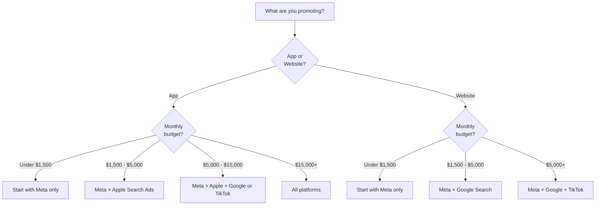

# Budget Planning

Setting an ad budget is one of the scariest decisions for beginners. How much should you spend? Where should you spend it? How do you know if you are wasting money? This guide answers all of those questions with simple math and practical frameworks.

The big idea is this: **your ad budget should be driven by math, not gut feelings.** When you understand a few key numbers — what a user is worth, what an install costs, and how long it takes to get payback — budget decisions become straightforward.

<Tip>
**For complete beginners**: If the math below feels intimidating, skip to the "Simple Starting Budgets" section first. You do not need to master unit economics before running your first campaign. But come back to the math once you have some data — it will transform how you think about ad spend.
</Tip>

---

## The Fundamental Equation

Every advertising budget decision comes down to one question:

**Does the money I spend acquiring a user come back as revenue?**

This is captured in two key metrics:

| Metric | What It Is | Formula |
|---|---|---|
| **LTV (Lifetime Value)** | How much revenue a user generates over their entire relationship with your app | Total Revenue / Total Users |
| **CAC (Customer Acquisition Cost)** | How much it costs to acquire one user through advertising | Total Ad Spend / Total New Users |

The golden rule: **LTV must be greater than CAC.** If you spend $5 to acquire a user who generates $20 in revenue, you have a profitable business. If you spend $5 to acquire a user who generates $2, you are losing money.

### The LTV:CAC Ratio

| LTV:CAC Ratio | What It Means | Action |
|---|---|---|
| **< 1:1** | Losing money on every user | Stop. Fix your monetization or reduce CAC. |
| **1:1 to 2:1** | Breaking even or slight profit | Proceed cautiously. Optimize before scaling. |
| **2:1 to 3:1** | Healthy | Good target for most businesses. |
| **3:1 to 5:1** | Very profitable | Scale more aggressively. |
| **> 5:1** | Extremely profitable | You are probably under-spending. Scale up. |

<Tip>
**Pro Tip**: A 3:1 LTV:CAC ratio is the widely accepted "healthy" benchmark. This means for every $1 you spend on ads, you get $3 back in revenue. A ratio below 2:1 is risky. Above 5:1 suggests you are leaving growth on the table by not spending enough.
</Tip>

---

## Calculating Your Key Numbers

### Step 1: Estimate Your LTV

If you are just starting out, you probably do not have enough data for a precise LTV. Here are ways to estimate:

<Tabs>
  <Tab title="Subscription App">
    ```
    Monthly LTV = Monthly Price x Average Months Retained

    Example:
    $9.99/month x 6 months average retention = $59.94 LTV
    ```

    If you offer a free trial: factor in your trial-to-paid conversion rate.
    ```
    Adjusted LTV = $59.94 x 30% trial conversion = $17.98
    ```
  </Tab>
  <Tab title="E-commerce / In-App Purchase">
    ```
    LTV = Average Order Value x Average Orders Per Customer

    Example:
    $35 average order x 2.5 orders per customer = $87.50 LTV
    ```
  </Tab>
  <Tab title="Ad-Supported (Free App)">
    ```
    LTV = Daily Ad Revenue Per User x Average Days Active

    Example:
    $0.02 per day x 30 days average = $0.60 LTV
    ```

    Note: Ad-supported apps typically have very low LTV, which means your CPI must be very low.
  </Tab>
  <Tab title="I Have No Idea">
    If you have no data at all, use **industry benchmarks** as a starting point:

    | App Type | Typical LTV Range |
    |---|---|
    | Games (casual) | $1 - $5 |
    | Games (mid-core) | $5 - $30 |
    | Subscription (fitness, meditation) | $10 - $60 |
    | Subscription (productivity, SaaS) | $20 - $200 |
    | E-commerce | $30 - $150 |
    | Finance / Fintech | $50 - $500+ |
  </Tab>
</Tabs>

### Step 2: Set Your Target CPI

Your target CPI (Cost Per Install) should be a fraction of your LTV:

```
Target CPI = LTV / Target LTV:CAC Ratio

Example:
LTV = $60
Target ratio = 3:1
Target CPI = $60 / 3 = $20

You should pay no more than $20 per install.
```

### Step 3: Calculate Your Monthly Budget

```
Monthly Budget = Target Installs Per Month x Target CPI

Example:
You want 500 new users per month
Target CPI = $20
Monthly Budget = 500 x $20 = $10,000/month
```

<Tip>
**Pro Tip**: When you are starting out, focus on **learning budgets**, not growth budgets. A learning budget is the minimum amount you need to spend to gather enough data to make informed decisions. Plan to spend at least $500-$1,000 in your first month just to learn what works before optimizing for growth.
</Tip>

---

## Simple Starting Budgets

If the math above is too much right now, here are practical starting points based on your situation:

### Budget by Stage

| Stage | Monthly Budget | Goal | Duration |
|---|---|---|---|
| **Testing** | $300 - $1,000 | Learn what works, gather data | 2-4 weeks |
| **Validating** | $1,000 - $3,000 | Confirm profitable channels and creatives | 1-2 months |
| **Growing** | $3,000 - $10,000 | Scale what works, test new channels | Ongoing |
| **Scaling** | $10,000 - $100,000+ | Aggressive growth across multiple platforms | Ongoing |

### Budget by Platform (Starting Recommendations)

| Platform | Minimum to Learn | Recommended First Month | Why |
|---|---|---|---|
| **Meta (Facebook/Instagram)** | $300/month ($10/day) | $600-$1,500 | Lowest minimum, fastest learning |
| **TikTok** | $1,500/month ($50/day) | $1,500-$3,000 | Higher minimums but great CPMs |
| **Google (App Campaigns)** | $300/month ($10/day) | $600-$1,500 | Intent-based, reliable |
| **Apple Search Ads** | $300/month | $500-$1,000 | High intent, high conversion |

---

## Platform Allocation: Where to Spend

If you have a limited budget, do not spread it across five platforms. Focus on one or two and do them well.

### Decision Framework



### Recommended Allocation Percentages

Once you are spending across multiple platforms, here is how to split your budget:

| Budget Range | Meta | Apple Search Ads | Google | TikTok |
|---|---|---|---|---|
| **$1,500 - $3,000** | 70% | 30% | — | — |
| **$3,000 - $10,000** | 50% | 20% | 20% | 10% |
| **$10,000 - $30,000** | 40% | 15% | 25% | 20% |
| **$30,000+** | 35% | 15% | 25% | 25% |

<Tip>
**Pro Tip**: These percentages are starting points, not rules. After your first month, shift budget toward whichever platform has the best CPI and LTV:CAC ratio. Let data drive your allocation, not assumptions.
</Tip>

---

## The Payback Period

Another critical number: how long does it take to earn back your ad spend?

```
Payback Period = CAC / Monthly Revenue Per User

Example:
CAC (CPI) = $20
Monthly revenue per user = $9.99
Payback Period = $20 / $9.99 = ~2 months
```

| Payback Period | Assessment |
|---|---|
| **Under 3 months** | Excellent — scale aggressively |
| **3-6 months** | Good — standard for most businesses |
| **6-12 months** | Acceptable if LTV is high enough |
| **Over 12 months** | Risky — requires strong retention and cash reserves |

<Tip>
**Pro Tip**: Your payback period determines how much **cash** you need. If payback is 6 months and you spend $10,000/month on ads, you need $60,000 in cash to fund the gap before revenue catches up. Shorter payback periods mean less cash needed. This is why many startups optimize for fast monetization events (like getting users to subscribe in the first week).
</Tip>

---

## Seasonal Budget Adjustments

Ad costs fluctuate throughout the year. Plan for these patterns:

| Period | Cost Impact | Why | Strategy |
|---|---|---|---|
| **January** | Lower costs | Advertisers pull back after holiday spending | Great time to test |
| **February-March** | Normal costs | Tax season, spring campaigns ramp up | Steady spending |
| **April-May** | Normal costs | Pre-summer period | Good testing window |
| **June-August** | Slightly lower costs | Summer slowdown for many industries | Good value period |
| **September-October** | Rising costs | Back-to-school, holiday prep begins | Moderate spending |
| **November-December** | Highest costs | Black Friday, holiday shopping, year-end budgets | CPMs can be 30-50% higher |

<Tip>
**Pro Tip**: November and December are the most expensive months to advertise. CPMs (cost per 1,000 impressions) can increase 30-50% due to holiday advertisers flooding the market. If possible, do your learning and testing in Q1 (January-March) when costs are lowest, and save your scaling budget for when you have proven creatives and campaigns.
</Tip>

---

## Budget Planning Template

Use this simple template to plan your monthly ad budget:

| Line Item | Value | How to Calculate |
|---|---|---|
| **Estimated LTV** | $ ____ | Revenue per user over their lifetime |
| **Target LTV:CAC ratio** | ____ :1 | 3:1 is a good starting target |
| **Target CPI** | $ ____ | LTV / LTV:CAC ratio |
| **Target monthly installs** | ____ | Your growth goal |
| **Monthly budget needed** | $ ____ | Target installs x Target CPI |
| **Platform 1 allocation** | $ ____ (____%) | Biggest share to best performer |
| **Platform 2 allocation** | $ ____ (____%) | Second platform |
| **Platform 3 allocation** | $ ____ (____%) | Third platform (if applicable) |
| **Creative production budget** | $ ____ | 10-20% of ad spend for creative |
| **Total monthly marketing budget** | $ ____ | Ad spend + creative + tools |

---

## When to Increase Your Budget

Scale up when you see these signals:

| Signal | What It Means | Action |
|---|---|---|
| CPI consistently below target | Your campaigns are profitable | Increase budget 20-30% per week |
| LTV:CAC ratio above 3:1 | Strong unit economics | Increase more aggressively |
| Impression share below 30% | There is more demand to capture | Increase budget to capture more |
| Creative performance is strong | Your ads resonate with users | Scale spend behind winning creatives |

## When to Decrease Your Budget

Pull back when you see these signals:

| Signal | What It Means | Action |
|---|---|---|
| CPI rising above target | Market is getting more competitive or creative is fatiguing | Reduce spend, refresh creatives |
| LTV:CAC ratio below 2:1 | Unit economics are unhealthy | Cut spend, optimize |
| Retention is dropping | New users are lower quality | Tighten targeting |
| Cash is tight | Business needs runway | Reduce to minimum viable budget |

---

## Key Takeaways

1. **Start with the math**: LTV, CAC, and LTV:CAC ratio are the foundation of all budget decisions
2. **Begin small and learn**: $500-$1,000 is enough to learn what works before committing bigger budgets
3. **Focus before you diversify**: One or two platforms done well beats five platforms done poorly
4. **Let data drive allocation**: Shift budget toward your best-performing platforms and campaigns
5. **Plan for seasonality**: Q4 costs are highest; Q1 costs are lowest
6. **Budget for creative production**: Great creative is 80% of your success — allocate 10-20% of ad spend for creative
7. **Watch your payback period**: Short payback reduces cash pressure and risk

<Tip>
**Final encouragement**: Every successful advertiser started with a modest budget and learned their way to scale. There is no shame in starting with $300/month on a single platform. The goal is to learn, validate, and then scale. You do not need to get it perfect on day one. You need to get data, learn from it, and improve every month.
</Tip>
