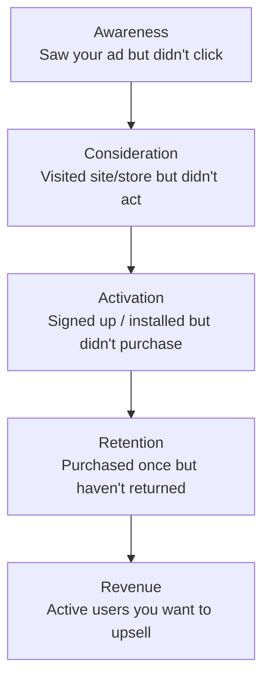
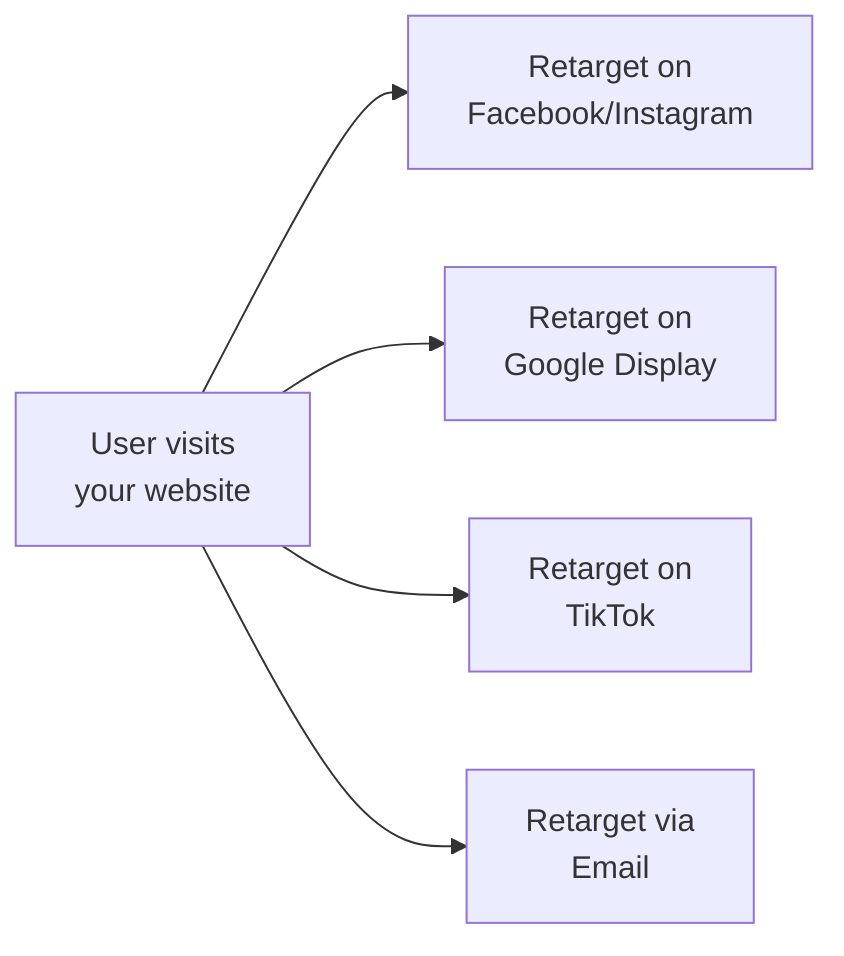

# Retargeting

You have spent money to get someone interested in your product. They visited your website, downloaded your app, or clicked your ad — but they did not convert. Without retargeting, that user (and the money you spent to reach them) is gone forever.

Retargeting (also called remarketing) lets you show ads specifically to people who already interacted with your brand. These people are your warmest audience — they already know you. They just need a nudge.

<Tip>
**Why retargeting matters**: On average, only 2-5% of first-time website visitors convert. That means 95-98% leave without taking action. Retargeting gives you a second (and third, and fourth) chance to convert them. Retargeting campaigns typically have 2-3x higher conversion rates and 50-70% lower CPA than cold prospecting campaigns.
</Tip>

---

## The Retargeting Funnel

Different users need different retargeting strategies based on where they are in their journey:

| Funnel Stage | Who They Are | Retargeting Goal | Creative Approach |
|---|---|---|---|
| **Awareness** | Saw your ad, did not click | Get them to click | Reinforce the value proposition with a different angle |
| **Consideration** | Visited your site/app store page | Get them to install or sign up | Social proof, reviews, limited-time offer |
| **Activation** | Installed app but did not complete key action | Get them to complete onboarding | Show the "aha moment," tutorial, or benefit they missed |
| **Retention** | Purchased once but went quiet | Get them to return | New features, new content, personalized recommendations |
| **Revenue** | Active users | Upsell, cross-sell, upgrade | Premium features, bundles, loyalty rewards |

---

## Platform Setup: How to Create Retargeting Audiences

### Meta (Facebook / Instagram)

<Steps>
  <Step title="Go to Audiences in Ads Manager">
    Navigate to **Audiences** in your Meta Ads Manager (under Assets or directly from the menu).
  </Step>
  <Step title="Create a Custom Audience">
    Click **"Create Audience" > "Custom Audience"** and choose your source:

    | Source | What It Retargets | Setup Needed |
    |---|---|---|
    | **Website** | People who visited specific pages | Meta Pixel installed |
    | **App Activity** | People who took actions in your app | Meta SDK installed |
    | **Customer List** | Your existing email/phone list | Upload hashed list |
    | **Video** | People who watched your video ads | No additional setup |
    | **Instagram/Facebook engagement** | People who interacted with your profile or ads | No additional setup |
  </Step>
  <Step title="Define your audience rules">
    Examples:
    - "People who visited the pricing page in the last 14 days but did not purchase"
    - "People who added to cart in the last 7 days but did not check out"
    - "People who installed the app in the last 30 days but did not subscribe"
  </Step>
  <Step title="Use the audience in your campaigns">
    When creating a new ad set, select your Custom Audience as the target audience.
  </Step>
</Steps>

### Google Ads

<Steps>
  <Step title="Create remarketing lists">
    In Google Ads, go to **Tools > Audience Manager** and create remarketing lists based on:
    - Website visitors (requires Google tag installed)
    - App users (requires Firebase SDK)
    - YouTube viewers
    - Customer match (email/phone upload)
  </Step>
  <Step title="Apply to campaigns">
    Add your remarketing audience to a Display, Search, or YouTube campaign as a targeting criterion.
  </Step>
</Steps>

### TikTok

<Steps>
  <Step title="Create a Custom Audience in Ads Manager">
    Go to **Assets > Audiences > Create Audience > Custom Audience**.
  </Step>
  <Step title="Choose your source">
    - **App Activity**: Users who installed, opened, or took specific actions
    - **Website Traffic**: Visitors tracked by TikTok Pixel
    - **Customer File**: Upload hashed email/phone list
    - **Engagement**: People who interacted with your TikTok ads
  </Step>
</Steps>

### Apple Search Ads

Apple Search Ads has more limited retargeting, but you can target:

- **Returning users**: People who have downloaded your app before but may have deleted it
- **Users of your other apps**: If you have multiple apps, target users of App A with ads for App B
- **All users / New users**: Segment by whether they have ever downloaded your app

---

## Creative Best Practices for Retargeting

Retargeting ads should be **different** from your prospecting (cold audience) ads. The person already knows who you are. Here is what to do differently:

### For Website/App Store Visitors Who Did Not Convert

| Strategy | Example |
|---|---|
| **Remind them** | "Still thinking about it? Here's what you're missing." |
| **Add social proof** | "Join 50,000+ users who already switched" |
| **Offer an incentive** | "Come back and get 20% off your first month" |
| **Address objections** | "Worried about X? Here's why you shouldn't be." |

### For Users Who Installed But Did Not Activate

| Strategy | Example |
|---|---|
| **Show the value** | "You haven't tried [key feature] yet — here's how" |
| **Tutorial / walkthrough** | "Set up in 60 seconds: here's how" |
| **Personalize** | "Your [goal] journey starts with one tap" |

### For Churned Users

| Strategy | Example |
|---|---|
| **New features** | "We added [feature] since you left — check it out" |
| **Win-back offer** | "We miss you. Here's 1 month free." |
| **FOMO** | "Your friends are already using [new feature]" |

<Tip>
**Pro Tip**: Never show the same ad to retargeting audiences that you showed during prospecting. They already saw that ad. Retargeting creative should address the specific reason they did not convert. Did they leave because of price? Show a discount. Did they leave because they did not understand the product? Show a tutorial. Match the message to the objection.
</Tip>

---

## Frequency Capping: Do Not Be Creepy

The biggest risk with retargeting is annoying your audience by showing them the same ad too many times. This is called **ad fatigue** and it can actually hurt your brand.

### Recommended Frequency Caps

| Funnel Stage | Recommended Frequency Cap | Why |
|---|---|---|
| **Consideration** | 2-3 impressions per user per day | They are interested but need a nudge, not harassment |
| **Activation** | 1-2 per day | Gentle reminders, not pressure |
| **Retention** | 3-5 per week | Less frequent, more relevant |
| **Win-back** | 1-2 per week | Very light touch — they left for a reason |

### How to Set Frequency Caps

- **Meta**: Set at the ad set level under "Optimization and Delivery" (limited controls, mostly algorithmic)
- **Google**: Set at the campaign level under "Additional Settings > Frequency Capping"
- **TikTok**: Set at the ad group level under "Frequency" settings
- **Programmatic (DV360, TTD)**: Full control over impressions per user per day/week

<Tip>
**Pro Tip**: If you cannot set explicit frequency caps (Meta makes this difficult for some campaign types), control frequency by keeping your retargeting audience **large** relative to your budget. A $20/day budget against a 100,000-person audience will naturally result in low frequency. The same $20/day against a 1,000-person audience will result in very high frequency.
</Tip>

---

## Exclusion Audiences: Equally Important

Exclusion audiences tell the platform who **NOT** to show your ads to. This is just as important as targeting:

| Exclusion | Why |
|---|---|
| **Existing subscribers/customers** | Do not waste money retargeting people who already converted |
| **Recent converters (7-14 days)** | Give them time to experience the product before upselling |
| **People who opted out / unsubscribed** | Respect their decision |
| **Employees and team members** | You do not want to inflate your own metrics |

<Steps>
  <Step title="Create exclusion audiences">
    Using the same Custom Audience creation process, create audiences for people you want to exclude.
  </Step>
  <Step title="Apply exclusions to every campaign">
    In your ad set / ad group targeting, add these as **exclusions**. This is critical for both retargeting AND prospecting campaigns.
  </Step>
</Steps>

---

## Dynamic Retargeting

**Dynamic retargeting** automatically shows users the specific products or content they viewed. Instead of a generic ad, each person sees the exact items they browsed.

### How It Works

1. User visits your site and views Product A, Product B, and Product C
2. Your pixel tracks which products they viewed
3. When you retarget them, the ad automatically shows Product A, B, and C in a carousel
4. Each user sees a personalized ad based on their browsing behavior

### Platform Support

| Platform | Dynamic Retargeting | Setup Requirement |
|---|---|---|
| **Meta** | Yes (Dynamic Ads / Advantage+ Catalog) | Product catalog upload |
| **Google** | Yes (Dynamic Remarketing) | Google Merchant Center feed |
| **TikTok** | Yes (Catalog Ads) | Product catalog upload |
| **Apple Search Ads** | No | Not applicable |

<Tip>
**Pro Tip**: Dynamic retargeting is most powerful for e-commerce and travel businesses where users browse multiple products. If you have a product catalog, set up dynamic retargeting immediately — it typically delivers the lowest CPA of any campaign type because the ads are highly personalized and relevant.
</Tip>

---

## Budget Allocation for Retargeting

A common question: what percentage of your total ad budget should go to retargeting?

| Total Monthly Budget | Retargeting Allocation | Why |
|---|---|---|
| **Under $3,000** | 10-15% | Small retargeting audiences; focus most budget on prospecting |
| **$3,000 - $10,000** | 15-25% | Growing retargeting pool; meaningful volume |
| **$10,000 - $50,000** | 20-30% | Large retargeting audiences; multiple funnel stages |
| **$50,000+** | 25-35% | Full-funnel retargeting across all platforms |

<Tip>
**Pro Tip**: Your retargeting audience size depends on your prospecting spend. More money spent on prospecting means more people visit your site or app store page, which means a larger retargeting audience. The two work together — do not treat them as separate strategies.
</Tip>

---

## Cross-Platform Retargeting

Your best retargeting strategy uses multiple platforms to reach users wherever they spend time:

### How to Set Up Cross-Platform Retargeting

1. Install pixels/tags from all platforms on your website
2. Create retargeting audiences on each platform
3. Coordinate messaging across platforms (do not show the exact same ad everywhere)
4. Monitor total frequency across all platforms to avoid over-exposure

---

## iOS Privacy Impact on Retargeting

With iOS App Tracking Transparency (ATT), retargeting on iOS has become significantly harder:

| Scenario | Impact |
|---|---|
| User opts in to tracking | Full retargeting available (only ~20-25% of iOS users) |
| User opts out of tracking | Very limited retargeting — platform-based only (engagement, video views) |
| Web-based retargeting | Still works via first-party cookies (limited to the same browser/device) |

### What Still Works

- **Engagement-based retargeting**: Target people who interacted with your content on the platform itself (liked, commented, watched video). This does not require cross-app tracking.
- **Customer list uploads**: Upload hashed email/phone lists to create audiences. This works regardless of ATT.
- **Server-side tracking**: Meta's Conversions API and Google's Enhanced Conversions improve retargeting signal despite client-side limitations.

---

## Key Takeaways

1. **Retargeting converts 2-3x better** than cold prospecting because you are reaching people who already know you
2. **Match your message to the funnel stage**: Awareness, consideration, activation, retention, and revenue each need different creative
3. **Set frequency caps**: 2-3 impressions per day maximum for most retargeting. More than that is annoying.
4. **Use exclusion audiences**: Do not retarget people who already converted
5. **Allocate 15-30% of budget** to retargeting depending on your total spend
6. **Dynamic retargeting** is the most powerful form — show users the specific products they viewed
7. **iOS privacy limits retargeting** on mobile, but engagement-based and list-based approaches still work

<Tip>
**Final thought**: Retargeting is one of the highest-ROI advertising strategies available. Every dollar you spend on prospecting creates potential retargeting audiences. Every dollar you spend on retargeting converts those audiences more efficiently. The two strategies are complementary — invest in both.
</Tip>
