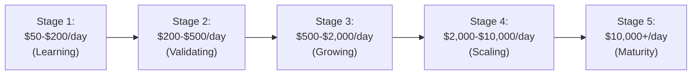
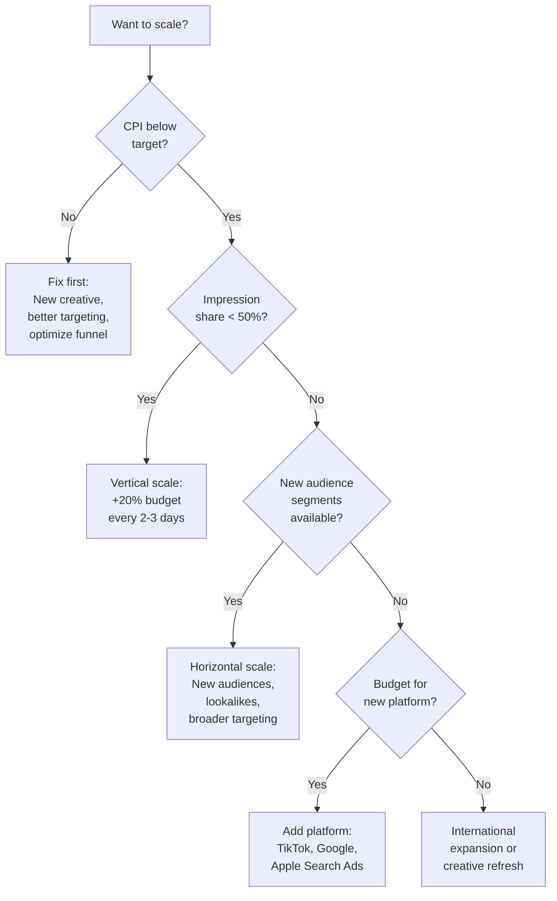

# Scaling Strategy

You have found campaigns that work. Your CPI is below target, your LTV:CAC ratio is healthy, and you want to grow. Scaling is the natural next step — but it is also where many advertisers make expensive mistakes.

Scaling is not just "spend more money." Done wrong, scaling destroys the performance that made you want to scale in the first place. Done right, it is the engine that turns a small business into a large one.

<Tip>
**The core truth of scaling**: The strategies that work at $50/day often break at $500/day. And the strategies that work at $500/day often break at $5,000/day. Each level of scale brings new challenges. This guide prepares you for each stage.
</Tip>

---

## The Scaling Staircase

Think of scaling as climbing a staircase, not riding an elevator. You go up one step at a time, stabilize, then go up again.

| Stage | Daily Spend | Key Focus | Main Risk |
|---|---|---|---|
| **Learning** | $50-$200 | Find profitable campaigns and creatives | Not enough data to draw conclusions |
| **Validating** | $200-$500 | Confirm profitability is repeatable | Premature scaling based on limited data |
| **Growing** | $500-$2,000 | Increase budget on proven winners | Performance degradation from too-fast scaling |
| **Scaling** | $2,000-$10,000 | Add platforms, markets, and audiences | Creative fatigue and audience saturation |
| **Maturity** | $10,000+ | Optimize efficiency across all channels | Diminishing returns, organizational complexity |

---

## Are You Ready to Scale?

Before increasing your budget, check these readiness criteria:

### Scaling Readiness Checklist

| Criteria | Why It Matters | Minimum Standard |
|---|---|---|
| **At least 2 weeks of data** | Short data periods give false positives | 14+ days of consistent campaign data |
| **CPI below target** | Scaling unprofitable campaigns just loses money faster | CPI consistently below your LTV-based target |
| **LTV:CAC ratio above 2:1** | Enough margin to absorb the efficiency loss that comes with scale | Ideally 3:1+ before scaling |
| **Multiple winning creatives** | Single creative will fatigue fast at higher spend | At least 3-5 winning ad variations |
| **Retention looks healthy** | Cheap installs with zero retention are worthless | Day 1 retention above 20%, Day 7 above 10% |
| **Tracking is accurate** | Bad data leads to bad decisions | Events firing correctly, attribution working |

<Tip>
**Pro Tip**: If even one of these criteria is not met, fix it before scaling. Scaling amplifies everything — good performance gets better, but bad performance gets worse faster.
</Tip>

---

## The 20% Rule: Vertical Scaling

The simplest and safest way to scale: increase budget on existing campaigns **no more than 20-30% every 2-3 days**.

### Why the 20% Rule Exists

Every ad platform (Meta, TikTok, Google, Apple) uses machine learning algorithms that learn from your campaign data. These algorithms enter a **learning phase** whenever you make significant changes. During the learning phase, performance is unstable and often worse.

A budget increase of 20-30% is small enough that most platforms can absorb it without resetting the learning phase. A budget increase of 100%+ (doubling your budget) almost always triggers a full learning reset.

### How to Apply It

<Steps>
  <Step title="Week 1: Baseline">
    Your campaign is running at $100/day with a $5 CPI (below your $8 target). Good.
  </Step>
  <Step title="Day 3-4: First increase">
    Increase daily budget from $100 to $120 (+20%). Monitor for 2-3 days.
  </Step>
  <Step title="Day 6-7: Second increase">
    If CPI is still good at $120/day, increase to $145 (+20%). Monitor for 2-3 days.
  </Step>
  <Step title="Continue the pattern">
    $145 -> $175 -> $210 -> $250 -> $300...

    At this rate, you go from $100/day to $300/day in about 2.5 weeks. It feels slow, but it protects your performance.
  </Step>
</Steps>

| Day | Budget | Change | Cumulative Growth |
|---|---|---|---|
| 1 | $100 | Baseline | — |
| 4 | $120 | +20% | +20% |
| 7 | $145 | +20% | +45% |
| 10 | $175 | +20% | +75% |
| 13 | $210 | +20% | +110% |
| 16 | $250 | +20% | +150% |
| 19 | $300 | +20% | +200% |

<Tip>
**Pro Tip**: If performance degrades after a budget increase, do NOT immediately reduce the budget. Wait 2-3 days — the algorithm may just be readjusting. If CPI is still elevated after 3 days, scale back to the previous budget level and stabilize before trying again.
</Tip>

---

## Horizontal Scaling

When vertical scaling hits a wall (your CPI rises no matter how slowly you increase budget), it is time for horizontal scaling — expanding to new audiences, new platforms, and new creatives.

### Dimension 1: New Audiences

<Steps>
  <Step title="Duplicate your best campaign">
    Create a copy of your winning campaign with a different audience:
    - Different age range
    - Different interests
    - Different lookalike source
    - Different gender (if applicable)
  </Step>
  <Step title="Test audience expansion">
    Most platforms (Meta, TikTok) have "audience expansion" or "broad targeting" features. These let the algorithm find users beyond your specified targeting. Often, broad targeting performs as well as or better than narrow targeting at scale.
  </Step>
  <Step title="Try value-based lookalikes">
    Instead of creating lookalikes based on all customers, create them based on your **highest-value** customers (top 10% by revenue, longest retention, highest engagement). These tend to find better users.
  </Step>
</Steps>

### Dimension 2: New Platforms

| Current Platform | Next Platform to Add | Why |
|---|---|---|
| **Meta only** | Apple Search Ads (apps) or Google (web) | Capture high-intent search traffic |
| **Meta + Apple** | TikTok or Google | Different audience, different creative style |
| **Meta + Google** | TikTok | Younger audience, creative-driven results |
| **All major platforms** | Programmatic, influencer, podcast | Diversify beyond walled gardens |

### Dimension 3: New Creatives

Creative is the single biggest lever for scaling on every platform.

| Creative Type | When to Use |
|---|---|
| **New hooks on winning format** | Your best video format + new opening 3 seconds |
| **New format entirely** | Try UGC, screen recordings, testimonials, before/after |
| **Creator content** | Partner with micro-creators for authentic content |
| **Seasonal variations** | Holiday themes, event-based, trend-based |
| **Platform-native formats** | Reels for Meta, Spark Ads for TikTok, YouTube Shorts for Google |

<Tip>
**Pro Tip**: When you hit a scaling wall, the answer is almost always **new creative**, not more budget on old creative. A fresh creative can unlock an entirely new audience segment that was not responding to your previous ads.
</Tip>

### Dimension 4: New Markets (International Expansion)

| Expansion Tier | Markets | Why This Order |
|---|---|---|
| **Tier 1** | UK, Canada, Australia | English-speaking, similar CPIs, easy entry |
| **Tier 2** | Germany, France, Japan, South Korea | Large markets, higher CPIs, need localization |
| **Tier 3** | Brazil, India, Southeast Asia, Mexico | Large user bases, lower CPIs, need heavy localization |

<Steps>
  <Step title="Start with English-speaking Tier 1 markets">
    Your existing creatives work with no changes. Same language, similar culture.
  </Step>
  <Step title="Localize for Tier 2">
    Translate your creatives and App Store listing. Localization is not just translation — adapt cultural references, currencies, and imagery.
  </Step>
  <Step title="Create native content for Tier 3">
    Partner with local creators or agencies. What works in the US rarely works in Brazil or India. You need locally relevant content.
  </Step>
</Steps>

---

## The Creative Scaling Process

At scale, creative is your main bottleneck. Here is a sustainable production process:

### Weekly Creative Cadence

| Day | Activity |
|---|---|
| **Monday** | Review last week's creative performance. Identify winners and losers. |
| **Tuesday** | Brainstorm new hook ideas and creative concepts based on winning patterns. |
| **Wednesday** | Film/produce 3-5 new creative variations. |
| **Thursday** | Edit, add text overlays and music. Upload to ad platforms. |
| **Friday** | Launch new creatives. Pause fatigued ones. |

### Creative Fatigue Signals

Your winning creative will eventually stop working. Watch for these signs:

| Signal | What It Means | Action |
|---|---|---|
| CTR dropping week over week | People have seen the ad too many times | Refresh the creative or pause it |
| CPI rising while spend is stable | The creative is losing effectiveness | Introduce new variations |
| Frequency above 3.0 | Each person sees your ad 3+ times on average | Expand audience or refresh creative |
| Video completion rate dropping | People are swiping past faster | New hook needed |

---

## Common Scaling Mistakes

<AccordionGroup>
  <Accordion title="Doubling your budget overnight">
    This almost always resets the learning phase and causes a temporary (sometimes permanent) CPI spike. Use the 20% rule instead.
  </Accordion>
  <Accordion title="Scaling unprofitable campaigns">
    "It will get better at higher spend" is almost never true. If a campaign is unprofitable at $100/day, it will be unprofitable at $1,000/day. Fix the problem first, then scale.
  </Accordion>
  <Accordion title="Relying on a single creative">
    One winning ad can carry you for 2-4 weeks. Then it fatigues. You need a continuous pipeline of new creative to sustain performance at scale.
  </Accordion>
  <Accordion title="Spreading budget too thin">
    Five platforms at $100/day each gives you $500/day in total but none of the platforms have enough budget to optimize effectively. Better to dominate two platforms than underperform on five.
  </Accordion>
  <Accordion title="Not tracking post-install quality">
    Cheap installs are worthless if users never open the app again. Always track retention, engagement, and revenue alongside CPI. The goal is profitable users, not just users.
  </Accordion>
  <Accordion title="Ignoring diminishing returns">
    Every platform has a natural ceiling. As you capture more of the available audience, each marginal user costs more. The answer is horizontal scaling (new platforms, new markets, new creatives), not forcing more money into a saturated channel.
  </Accordion>
</AccordionGroup>

---

## Scaling Decision Framework

Use this framework when deciding how to scale:

---

## Key Takeaways

1. **Scale gradually**: The 20% rule protects your performance while growing spend
2. **Horizontal beats vertical**: When budget increases stop working, expand audiences, platforms, and creatives instead
3. **Creative is the bottleneck**: At scale, you need a continuous pipeline of fresh creatives (3-5 per week)
4. **Watch for fatigue**: CTR decline, CPI increase, and high frequency are early warning signs
5. **Track quality, not just quantity**: Cheap installs with no retention are worse than expensive installs with high LTV
6. **International expansion unlocks new growth**: Start with Tier 1 English-speaking markets, then localize for Tier 2 and 3
7. **Use the decision framework**: Follow the logic — fix profitability first, then vertical scale, then horizontal scale

<Tip>
**Final thought**: Scaling is a marathon, not a sprint. The advertisers who scale successfully are the ones who are patient, data-driven, and constantly producing new creative. Rush the process and you waste money. Follow the staircase approach and you build a sustainable growth engine.
</Tip>
